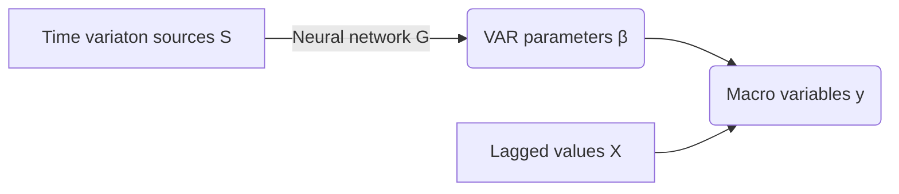

# Deep Time-Varying Parameters (DTVP) Structural VAR model (SVAR)

*By Rodrigo Chang (rrcp@banguat.gob.gt) at Banco de Guatemala* 
*@r2cp*

This is a toy example of a prototype model that combines a Multilayer Perceptron to estimate the time-varying coefficients of a SVAR. 

This is work-in-progress. Inspiration for this work comes from [Prof. Phillippe Coulombe](https://philippegouletcoulombe.com/)'s idea of a *Macro Neural Network*. 

I will upload here the following work: 
- `scripts/nn-svar.jl`: The toy example network estimated with simulated data. 
- `scripts/poly-example.jl`: This is an example I worked for understanding how to estimate a neural network with the `Lux.jl` package in Julia. 
- `notebooks\intro.qmd`: This is a [Quarto](https://quarto.org/) notebook with my elevator-pitch presentation given on Sept. 2. 
- `notebooks\final.qmd`: This is the Quarto presentation with my progress at the end of the course. 

